# Proyecto 1: planificación, análisis y diseño de pruebas

CS5383 - Verificación y Pruebas de Software

Caso 3: E-commerce con panel administrativo - OpenCart

Grupo 5

Integrantes: Franco Roque Castillo y Granit Espinoza Salazar

Fecha de entrega: 25 de septiembre de 2026

---

# 1. Planificación de pruebas

## 1.1 Objetivos

Objetivo general: evaluar con pruebas trazables y priorizadas por riesgo la consistencia del flujo comercial y su relación con administración en el demo OpenCart, produciendo evidencia reproducible que sustente hallazgos y decisiones de continuación.

Objetivos específicos: (1) separar requisitos de observaciones; (2) cubrir en diseño los 11 requisitos clave; (3) diseñar al menos 15 casos en 4 funcionalidades, con técnicas de caja negra distintas; (4) intentar todos los casos Alta y registrar paso alcanzado, esperado, obtenido y veredicto; (5) detectar inconsistencias de importes, stock y descuentos; (6) identificar bloqueos sin presentarlos como aprobaciones; (7) proponer automatización fundada en lo observado.

## 1.2 Alcance incluido y excluido

Incluido: FUN-01 catálogo y orden; FUN-02 ficha/opciones; FUN-03 cantidades y recálculo; FUN-04 cupones y diseño complementario de certificados; FUN-05 invitado; FUN-06 confirmación; FUN-07 stock administrativo; FUN-08 pedidos; RNF-01 propagación público a panel; RNF-02 compatibilidad seleccionada; RNF-03 respuesta de catálogo. Filtros y certificados tienen casos complementarios Media para mantener alcance sin ampliar la ejecución obligatoria.

Excluido de esta iteración: desarrollo o modificación del código OpenCart; pagos reales; pruebas de carga/estrés contra el demo; auditoría de seguridad; pruebas unitarias sin código; combinatoria completa de navegadores/dispositivos; CRUD general de categorías y productos, registro/login exhaustivo, devoluciones, afiliados y newsletters. La administración se usa para lectura y la prueba específica de agotados si existen permisos. Estas exclusiones no eliminan ninguno de los 11 requisitos clave.

## 1.3 Estrategia y niveles

Estrategia principal analítica basada en riesgos: priorizar dinero, inventario, descuentos y finalización de compra. Se complementa con diseño basado en requisitos y exploración acotada para reconocer datos y bloqueos. La frecuencia de cambios del demo exige volver a verificar stock, cupones y opciones antes de cada caso; la incertidumbre del ambiente no reduce artificialmente su prioridad.

| Nivel | Profundidad y justificación |
| --- | --- |
| Componente | No ejecutado: no se dispone de código, aislamiento ni instrumentación de unidades. Recomendado para cálculos en ambiente del desarrollador. |
| Integración | Observación a través de UI de carrito-checkout y sitio público-panel. No se atribuye cobertura de APIs internas ni bases de datos. |
| Sistema | Nivel principal: comportamiento externo del sistema desplegado con flujos positivos y negativos. |
| Aceptación | Validación orientada a los criterios del caso; no equivale a aceptación firmada por cliente ni liberación de producción. |

Tipos: funcionales positivos/negativos; no funcionales de rendimiento y compatibilidad planificados; revisión estática de requisitos, casos y evidencias; confirmación de defectos cuando exista corrección y regresión futura sobre funciones relacionadas. La revisión del informe sí se realizó; no se afirma haber ejecutado pruebas de componente ni cobertura estructural de código.

## 1.4 Criterios de entrada, salida, suspensión y reanudación

| Criterio | Regla verificable |
| --- | --- |
| Entrada común | Base y casos versionados; acceso al demo; captura de configuración relevante; datos ficticios; carrito controlado; evidencia con fecha/URL. |
| Entrada específica | Producto/opciones válidos; stock y política para fronteras; cupón vigente para positivo; orden propia para pedidos/sincronización; instrumento para rendimiento. Si falta, registrar Bloqueado. |
| Salida académica | Plan, riesgos, 26 condiciones, 18 casos con campos completos, registro para 14 Alta, hallazgos con evidencia y reflexión de automatización dentro del PDF. Los bloqueos son resultados permitidos por el enunciado; no se cuentan como pruebas superadas. |
| Salida para afirmar calidad | No se recomienda la aceptación del sistema mientras existan fallos monetarios o de checkout y riesgos de prioridad Alta sin verificar. |
| Suspensión | Desafío de acceso no resuelto, pérdida de sesión, cambio concurrente de fixture, falta de permiso o precondición, instrumento inválido. Suspender el caso afectado; continuar independientes. |
| Reanudación | Acceso normal y fixture revalidado; permisos concedidos por proveedor; pago/cupón/opciones disponibles; registrar nueva corrida y repetir dependientes sin sobrescribir evidencia anterior. |

La tasa de aprobación se calcula sobre los casos con veredicto Pasó o Falló. Los casos Bloqueados se informan por separado.

## 1.5 Recursos, responsabilidades y esfuerzo

| Responsable/recurso | Asignación |
| --- | --- |
| Franco | Catálogo, producto, carrito y cupones; riesgos asociados; condiciones FUN-01 a FUN-04; apoyo en RNF-03. |
| Granit | Checkout, confirmación, administración y pedidos; condiciones FUN-05 a FUN-08; RNF-01 y RNF-02. |
| Ambos | Revisión cruzada, consistencia del documento, control de versiones y decisión de entrega. |
| Herramientas | OpenCart Demo y panel administrativo; navegador de escritorio en Windows; capturas PNG y registros de resultados. |
| Dependencias externas | Permisos del panel, productos con opciones, cupones vigentes, medios de pago e instrumentación para rendimiento. |

| Actividad | Franco(h) | Granit(h) | Total estimado |
| --- | --- | --- | --- |
| Adecuación y base | 1 | 1 | 2 |
| Plan, riesgos, condiciones | 2 | 2 | 4 |
| Diseño y datos | 3 | 3 | 6 |
| Ejecución Alta/evidencias | 3 | 3 | 6 |
| Hallazgos, cierre, revisión | 2 | 2 | 4 |
| Reserva por bloqueos | 1 | 1 | 2 |
| Total | 12 | 12 | 24 |

La estimación total es de 24 horas para dos integrantes. La reserva se destina a revalidar precondiciones y reejecutar los casos bloqueados.

| Fecha | Hito | Resultado |
| --- | --- | --- |
| 18/09 | Exploración inicial | Identificación de funcionalidades y datos disponibles. |
| 24/09 | Planificación, análisis y diseño | Condiciones, riesgos y casos de prueba definidos. |
| 25/09 | Ejecución y consolidación | Casos de prioridad Alta registrados con evidencias y veredictos. |
| Después de habilitar el ambiente | Reejecución de casos bloqueados | Pendiente de datos, permisos e instrumentación. |

## 1.6 Registro de riesgos de producto

Escala: probabilidad P1 baja, P2 media, P3 alta; impacto I1 menor, I2 operacional, I3 dinero/flujo crítico. Exposición=P×I; 6-9 Alta, 3-4 Media, 1-2 Baja. Estimaciones cualitativas del equipo, no probabilidades estadísticas. La prioridad de condiciones/casos sigue esa exposición; un bloqueo no reduce riesgo. R12 queda Media, coherente conCP-VAL-01, sin condición Alta contradictoria.

| ID / riesgo | P×I / nivel | Responsable | Tratamiento / casos |
| --- | --- | --- | --- |
| R01 Inventario divergente entre ficha, carrito y panel | 3 x 3=9 / Alta | Franco / Granit | Verificar S y S+1; contrastar estado guardado con sitio público. CP-CAR-02; CP-ADM-01 |
| R02 Cupón válido rechazado o descuento incorrecto | 3 x 3=9 / Alta | Franco | Confirmar vigencia, estado, elegibilidad, base y tipo de descuento antes de probar. CP-CUP-01; CP-CUP-02 |
| R03 Importes de línea, impuestos o total inconsistentes | 3 x 3=9 / Alta | Franco / Granit | Comparar magnitudes con igual tratamiento fiscal y recalcular a dos decimales. CP-CAR-01; CP-PRO-02; CP-CON-01 |
| R04 Compra con opción obligatoria ausente o distinta | 2 x 3=6 / Alta | Franco | Omitir campo aislado; comparar opción elegida y conservada en carrito. CP-PRO-01; CP-PRO-02 |
| R05 Venta por encima de stock real | 3 x 3=9 / Alta | Franco / Granit | Leer stock actual y política; no equiparar botón activo a venta completada. CP-CAR-02; CP-ADM-01 |
| R06 Acumulación indebida o permanencia de descuentos | 2 x 3=6 / Alta | Franco | Reaplicar código y cambiar elegibilidad; exigir una sola aplicación. CP-CUP-02 |
| R07 Checkout invitado no completado | 3 x 3=9 / Alta | Granit | Validar campos, pago disponible y confirmación sin cuenta. CP-CHK-01; CP-CON-01 |
| R08 Pedido perdido o duplicado en administración | 2 x 3=6 / Alta | Granit | Usar orden propia, contar coincidencias y medir público a panel. CP-CON-02; CP-PED-01; CP-RNF-01 |
| R09 Catálogo lento o precio ordenado incorrectamente | 2 x 3=6 / Alta | Franco / Granit | Secuencia de precios de venta y medición instrumentada del catálogo. CP-CAT-02; CP-RNF-03 |
| R10 Incompatibilidad en navegador seleccionado | 2 x 2=4 / Media | Granit | Diseño común en Chrome, Edge y Firefox; no generalizar un motor a los demás. CP-RNF-02 |
| R11 Orden por nombre o filtros confusos | 2 x 2=4 / Media | Franco | Comparar conjuntos y orden; vacíos y filtros sin resultados. CP-CAT-01; CP-CAT-03 |
| R12 Certificado de regalo aceptado indebidamente | 1 x 3=3 / Media | Franco | Verificar saldo y vigencia; no probar certificados ajenos. CP-VAL-01 |

Riesgos de proyecto: demo compartido cambia datos, permisos limitados, bloqueo de acceso, ausencia de instrumentos y fecha de entrega. Mitigación: identificar precondiciones por corrida, conservar capturas, ejecutar independientes, reportar bloqueos y preparar fixtures para un ambiente controlado. Responsable de coordinación: ambos integrantes.

---

# 2. Análisis de pruebas y trazabilidad

Matriz vigente: 26 condiciones, cada una vinculada a requisito o alcance/riesgo explícito y a caso. Alta incluye justificación de impacto. Todos los 11 requisitos originales tienen al menos un caso de diseño; esto no significa que los 11 hayan sido verificados satisfactoriamente.

| Condición / qué comprobar | Base / origen | Prioridad / riesgo | Caso(s) / razón |
| --- | --- | --- | --- |
| CT-CAT-01: Orden correcto por nombre en ambos sentidos. | E-RF01; Directa | Media; R11 | CP-CAT-01. Afecta localización; impacto monetario indirecto. |
| CT-CAT-02: Precios de venta monótonos, mismos productos, ascendente y descendente. | E-RF01; Directa | Alta; R09 | CP-CAT-02. Un orden incorrecto distorsiona la comparación económica de productos. |
| CT-CAT-03: Categoría/filtro limita el conjunto y comunica resultado vacío. | Alcance p.4; Derivada | Media; R11 | CP-CAT-03. Cobertura complementaria del catálogo. |
| CT-PRO-01: Omisión aislada de opción requerida impide añadir y señala el campo. | E-RF02; Directa | Alta; R04 | CP-PRO-01. Evita pedidos de variantes incompletas o imposibles de preparar. |
| CT-PRO-02: Selección válida se conserva y se añade una sola línea correcta. | E-RF02; Derivada | Alta; R04 | CP-PRO-02. La variante comprada determina qué se entrega. |
| CT-PRO-03: El ajuste de precio de opción coincide con configuración y política fiscal. | E-RF02 / E-RF03; Derivada | Alta; R03 | CP-PRO-02. El error altera el importe cobrado. |
| CT-CAR-01: Cantidad válida actualiza línea, subtotal, impuestos y total coherentemente. | E-RF03; Directa | Alta; R03 | CP-CAR-01. Discrepancias monetarias afectan directamente al cliente. |
| CT-CAR-02: Cero, negativo, decimal, texto y vacío no dejan cantidades inválidas comprables. | E-RF03; Derivada | Alta; R03 | CP-CAR-02. Evita totales o unidades imposibles; normalizaciones se registran aparte. |
| CT-CAR-03: S es admisible y S+1 señala insuficiencia; bloqueo según política de stock. | E-RF08 / riesgo p.5; Derivada | Alta; R05 | CP-CAR-02. La sobreventa es una queja central del caso. |
| CT-CUP-01: Código vigente y elegible aplica el descuento correcto una vez. | E-RF04; Directa | Alta; R02 | CP-CUP-01. Protege el margen comercial y el importe final. |
| CT-CUP-02: Código inexistente, vencido o deshabilitado muestra error sin descuento nuevo. | E-RF04; Directa | Alta; R02 | CP-CUP-02. Una aceptación indebida reduce el ingreso sin autorización comercial. |
| CT-CUP-03: Cupón vigente pero no elegible se rechaza sin descuento. | E-RF04; Derivada | Alta; R02 | CP-CUP-02. Impide extender promociones a productos no cubiertos. |
| CT-CUP-04: Reaplicar el mismo cupón no acumula el descuento. | Riesgo p.5; Derivada | Alta; R06 | CP-CUP-02. La duplicación de descuentos es riesgo expreso del caso. |
| CT-CUP-05: Cambiar cantidad/productos revalida mínimo y elegibilidad. | E-RF04; Derivada | Alta; R06 | CP-CUP-02. Evita conservar beneficios cuando desaparece su precondición. |
| CT-CUP-06: Certificado válido respeta saldo y certificado inválido no descuenta. | Alcance p.4; Derivada | Media; R12 | CP-VAL-01. Complemento de alcance; sin evidencia de exposición alta en esta corrida. |
| CT-CHK-01: Invitado avanza sin crear cuenta ni imponer contraseña. | E-RF05; Directa | Alta; R07 | CP-CHK-01; CP-CON-01. Es el recorrido de compra exigido por el caso. |
| CT-CHK-02: Apellido obligatorio vacío se identifica; datos válidos se guardan. | E-RF05; Derivada | Alta; R07 | CP-CHK-01. Datos incompletos comprometen el procesamiento del pedido. |
| CT-CHK-03: Hay método de pago aplicable antes de confirmar. | E-RF05; Derivada | Alta; R07 | CP-CHK-01. Su ausencia interrumpe el flujo crítico. |
| CT-CON-01: Confirmación genera un identificador de orden no vacío. | E-RF06; Directa | Alta; R08 | CP-CON-01. Sin identificador no hay seguimiento confiable. |
| CT-CON-02: Resumen confirmado conserva productos, opciones, cantidades e importes. | E-RF06; Directa | Alta; R03 | CP-CON-01. Evita divergencias entre intención de compra y pedido. |
| CT-CON-03: Doble clic, recarga y retorno no crean pedidos adicionales. | E-RF06; Derivada | Alta; R08 | CP-CON-02. Evita cobro y preparación duplicados. |
| CT-PED-01: Orden propia aparece en panel con igual ID y detalle. | E-RF07; Directa | Alta; R08 | CP-PED-01. Una orden invisible impide su atención operativa. |
| CT-ADM-01: Stock cero guardado y estado agotado se reflejan en interfaz pública. | E-RF08; Directa | Alta; R01 / R05 | CP-ADM-01. Evita anunciar disponibilidad contradictoria al inventario confirmado. |
| CT-RNF-01: Orden pública se refleja en panel sin reinicio; medir contra referencia interna de 60 s. | E-RNF01; Operacionalizada | Alta; R08 | CP-RNF-01. La demora puede causar pérdida de atención o reintentos. |
| CT-RNF-02: Mismo recorrido funciona en Chrome, Edge y Firefox seleccionados. | E-RNF02; Operacionalizada | Media; R10 | CP-RNF-02. Se prioriza después de los riesgos transaccionales comunes. |
| CT-RNF-03: Carga completa de catálogo inferior a 2000 ms bajo protocolo declarado. | E-RNF03; Operacionalizada | Alta; R09 | CP-RNF-03. La lentitud afecta la operación de entrada al flujo de compra. |

## 2.1 Cobertura de requisitos clave

| Base | Casos | Resultado de cobertura |
| --- | --- | --- |
| E-RF01 | CP-CAT-01/02 | Diseño completo de nombre/precio; sólo precio ejecutado por prioridad. |
| E-RF02 | CP-PRO-01/02 | Omisión pasa; positivo/opciones bloqueado. |
| E-RF03 | CP-CAR-01/02 | Recálculo falla; cantidades/frontera ensayadas. |
| E-RF04 | CP-CUP-01/02 | Rechazo inválido observado; descuento válido/duplicación bloqueados. |
| E-RF05 | CP-CHK-01; CP-CON-01 | Preparación de invitado falla en pago; compra final bloqueada. |
| E-RF06 | CP-CON-01/02 | Confirmación e idempotencia bloqueadas. |
| E-RF07 | CP-PED-01 | Bloqueado por falta de orden propia. |
| E-RF08 | CP-ADM-01; CP-CAR-02 | Cambio administrativo bloqueado; frontera de stock sólo cubre detalle derivado. |
| E-RNF01 | CP-RNF-01 | Dirección corregida; bloqueado sin orden pública. |
| E-RNF02 | CP-RNF-02 | Diseñado Media; no ejecutado en selección actual. |
| E-RNF03 | CP-RNF-03 | Diseñado; medición verificable bloqueada. |

La cobertura se calcula sobre los 8 requisitos funcionales y los 3 requisitos no funcionales del Caso 3. Cada requisito tiene al menos una condición y un caso de prueba relacionado. Las variantes de datos se registran dentro de su caso y no se contabilizan como casos adicionales.

---

# 3. Diseño de pruebas

18 casos únicos: 8 centrales Franco, 8 Granit y 2 complementarios Media. Se cubren las 8 funcionalidades y 3 RNF. Selección: 14 Alta se intentan/registran; 4 Media permanecen diseñados. La línea base Franco se guardó antes de la corrida; las mejoras de redacción y trazabilidad se versionan sin alterar retroactivamente sus oráculos.

| Caso | Responsable | Prioridad | Técnica |
| --- | --- | --- | --- |
| CP-CAT-01 Ordenamiento por nombre | Franco | Media | Partición de equivalencia |
| CP-CAT-02 Ordenamiento por precio | Franco | Alta | Partición de equivalencia |
| CP-PRO-01 Omisión de opción obligatoria | Franco | Alta | Partición de equivalencia |
| CP-PRO-02 Opciones válidas y variación de precio | Franco | Alta | Partición de equivalencia |
| CP-CAR-01 Actualización de cantidad válida | Franco | Alta | Partición de equivalencia |
| CP-CAR-02 Cantidad inválida o superior al stock | Franco | Alta | Partición de equivalencia y valores límite |
| CP-CUP-01 Aplicación de cupón válido | Franco | Alta | Partición de equivalencia |
| CP-CUP-02 Cupón inválido, no aplicable o duplicado | Franco | Alta | Tabla de decisión y transición de estados |
| CP-CHK-01 Checkout invitado hasta pago | Granit | Alta | Partición de equivalencia |
| CP-CON-01 Número y resumen del pedido | Granit | Alta | Prueba de caso de uso |
| CP-CON-02 Prevención de pedidos duplicados | Granit | Alta | Transición de estados |
| CP-ADM-01 Agotado en panel reflejado públicamente | Granit | Alta | Tabla de decisión |
| CP-PED-01 Pedido público visible en panel | Granit | Alta | Prueba de caso de uso |
| CP-RNF-01 Tiempo de actualización público a administración | Granit | Alta | Transición de estados y medición temporal |
| CP-RNF-02 Compatibilidad en navegadores | Granit | Media | Partición de equivalencia |
| CP-RNF-03 Tiempo de respuesta del catálogo | Granit / Franco | Alta | Medición de rendimiento con umbral |
| CP-CAT-03 Categoría y filtros del catálogo | Franco | Media | Partición de equivalencia |
| CP-VAL-01 Certificados de regalo | Franco | Media | Tabla de decisión |

## 3.1 Técnicas y oráculos

Partición de equivalencia: criterios de orden, campo presente/ausente y cupones válidos/inválidos. Valores límite:CP-CAR-02 usa 0/1 y 147/148 junto a la frontera real de stock; no se confunde un umbral temporal con generar entradas controladas alrededor de él. Tabla de decisión:CP-CUP-02 cruza validez y elegibilidad;CP-ADM-01 cruza stock y política. Transición de estados: reaplicación de cupón y reintento de orden. Casos de uso complementan la comparación entre interfaces.

| Regla cupón | Vigente/activo | Elegible | Ya aplicado | Acción esperada |
| --- | --- | --- | --- | --- |
| A/B | No | Indiferente | No | Error, sin nuevo descuento |
| C | Sí | No | No | Error, sin nuevo descuento |
| D1 | Sí | Sí | No | Aplicar una vez |
| D2 | Sí | Sí | Sí | No acumular |
| E | Sí | De Sí a No | Sí | Retirar o recalcular según regla |

Datos volátiles: recapturar precios, stock, opciones, cupones, pago y hora antes de cada ejecución. No reutilizar 147 o 122 como constante permanente. Moneda USD e idioma inglés en corrida actual. Datos personales usados son ficticios; no se completaron compras ni se enviaron correos. Tokens de sesión no son datos de prueba y se eliminan de registros exportados cuando aparecen.

---

# 3.2 CP-CAT-01 - Ordenamiento por nombre

Responsable: Franco. Prioridad: Media. Condición: CT-CAT-01. Base: E-RF01.

## Técnica y justificación

Partición de equivalencia. Se comparan las clases A-Z y Z-A, incluyendo empate sin exigir un desempate no especificado.

## Precondiciones

Categoría accesible con al menos dos nombres distintos; idioma inglés; registrar listado completo y número de páginas.

## Datos de prueba

Desktops; mostrar 25 (12 productos observados como referencia, recapturar en nueva corrida).

## Pasos

1. Abrir categoría y guardar conjunto inicial de nombres.

2. Seleccionar Name (A - Z); leer todas las páginas o mostrar todos.

3. Comparar nombres consecutivos; registrar empates.

4. Seleccionar Name (Z - A) y repetir; comparar conjunto final con inicial.

## Resultado esperado

Orden lexicográfico correcto en ambos sentidos para nombres de la muestra; sin pérdidas ni duplicados. No ejecutado por prioridad Media.

Evidencia a conservar: ID de caso/variante, fecha y hora, URL, datos efectivos, estado previo/posterior y captura legible. Restablecer carrito y, si corresponde, fixture modificado. El resultado obtenido se mantiene en sección 4, separado del diseño.

---

# 3.2 CP-CAT-02 - Ordenamiento por precio

Responsable: Franco. Prioridad: Alta. Condición: CT-CAT-02. Base: E-RF01.

## Técnica y justificación

Partición de equivalencia. Ascendente y descendente son clases del criterio; se incluyen precios iguales y promociones.

## Precondiciones

Catálogo disponible, misma moneda USD y al menos dos precios distintos. Usar precio vigente, no precio tachado.

## Datos de prueba

Desktops; Show 25; 12 productos. Referencias: Canon 98, Apple 110, HP122, HTC122, iPod Classic 122, Product 8 122, i Phone 123.20, Samsung 242, Palm 337.99, MacBook 602, MacBook Air 1202, Sony 1202.

## Pasos

1. Abrir Desktops, seleccionar Show 25 y anotar productos/precios.

2. Seleccionar Price (Low > High); comparar cada precio con el siguiente.

3. Capturar lista y criterio.

4. Seleccionar Price (High > Low); repetir y comprobar igualdad del conjunto.

## Resultado esperado

Ascendente no decrece; descendente no crece; los 12 productos se conservan. Empates permitidos. Precio especial 98 de Canon se ordena por 98, no por 122.

Evidencia a conservar: ID de caso/variante, fecha y hora, URL, datos efectivos, estado previo/posterior y captura legible. Restablecer carrito y, si corresponde, fixture modificado. El resultado obtenido se mantiene en sección 4, separado del diseño.

---

# 3.2 CP-PRO-01 - Omisión de opción obligatoria

Responsable: Franco. Prioridad: Alta. Condición: CT-PRO-01. Base: E-RF02.

## Técnica y justificación

Partición de equivalencia. Una opción requerida ausente representa la clase inválida; se aísla de otros campos.

## Precondiciones

Carrito vacío; producto con una opción obligatoria identificada; resto de datos válido. Registrar si carece de alternativas válidas, sin confundirlo con la validación de ausencia.

## Datos de prueba

Canon EOS5 D, Select sin elegir, cantidad 1. El 25/09 sólo se ofreció el placeholder.

## Pasos

1. Abrir ficha; identificar campo requerido y contador del carrito.

2. Dejar Select sin seleccionar, cantidad 1 y pulsar Add to Cart una vez.

3. Esperar respuesta, registrar mensaje y verificar que el carrito permanece vacío.

## Resultado esperado

No se añade el producto y el mensaje identifica Select. No demuestra que existan opciones válidas ni valida su precio.

Evidencia a conservar: ID de caso/variante, fecha y hora, URL, datos efectivos, estado previo/posterior y captura legible. Restablecer carrito y, si corresponde, fixture modificado. El resultado obtenido se mantiene en sección 4, separado del diseño.

---

# 3.2 CP-PRO-02 - Opciones válidas y variación de precio

Responsable: Franco. Prioridad: Alta. Condición: CT-PRO-02; CT-PRO-03. Base: E-RF02 / E-RF03 derivados.

## Técnica y justificación

Partición de equivalencia. Comparar opción sin recargo y con recargo manteniendo constantes producto, cantidad e impuestos.

## Precondiciones

Producto con todas las opciones requeridas seleccionables, stock suficiente y ajuste fiscalmente interpretable; carrito limpio. Registrar precio base, ajuste y si incluye impuestos antes de ejecutar.

## Datos de prueba

Candidato Apple Cinema 30: Select Blue +5.60, Green +3.20 y Checkbox 3 +38 mostrados; faltan alternativas Radio. Alternativos Canon y Product 8 tampoco tienen opciones seleccionables. Datos válidos completos pendientes de provisión.

## Pasos

1. Verificar todas las alternativas requeridas; si alguna falta, registrar bloqueo sin inventar selección.

2. En ambiente habilitado, completar opciones válidas y añadir una unidad o el mínimo del producto.

3. Comparar opciones y precio en carrito contra base más ajustes con igual criterio fiscal.

4. Vaciar, cambiar sólo una opción de recargo conocido y repetir.

## Resultado esperado

Cada configuración agrega exactamente lo solicitado; diferencia de precio corresponde al ajuste configurado e impuestos aplicables. Sin alternativas o regla fiscal verificable: Bloqueado.

Evidencia a conservar: ID de caso/variante, fecha y hora, URL, datos efectivos, estado previo/posterior y captura legible. Restablecer carrito y, si corresponde, fixture modificado. El resultado obtenido se mantiene en sección 4, separado del diseño.

---

# 3.2 CP-CAR-01 - Actualización de cantidad válida

Responsable: Franco. Prioridad: Alta. Condición: CT-CAR-01. Base: E-RF03.

## Técnica y justificación

Partición de equivalencia. Se verifica una cantidad válida antes y después del cambio; se separa importe neto del gravado.

## Precondiciones

Carrito limpio, iPod Nano disponible sin opciones, sin cupón ni envío aplicado; cantidad 2 dentro de stock.

## Datos de prueba

USD; iPod Nano 1 y 2. Referencia: base 100, precio mostrado 122, Eco Tax 2/unidad, VAT20/unidad.

## Pasos

1. Añadir 1 iPod Nano y guardar unitario, línea, subtotal, impuestos y total.

2. Cambiar cantidad a 2 y pulsar actualizar; esperar respuesta.

3. Recalcular línea usando unitario mostrado por cantidad cuando ambos representan la misma base fiscal.

4. Comparar subtotal 200, Eco Tax 4, VAT40 y total 244; registrar cualquier discrepancia de línea.

## Resultado esperado

Para los datos observados: 1 unidad línea 122 total 122; 2 unidades línea 244 total 244, neto 200 y tributos 44. Si la interfaz usa otra base fiscal debe explicitarla; no comparar línea gravada con subtotal neto.

Evidencia a conservar: ID de caso/variante, fecha y hora, URL, datos efectivos, estado previo/posterior y captura legible. Restablecer carrito y, si corresponde, fixture modificado. El resultado obtenido se mantiene en sección 4, separado del diseño.

---

# 3.2 CP-CAR-02 - Cantidad inválida o superior al stock

Responsable: Franco. Prioridad: Alta. Condición: CT-CAR-02; CT-CAR-03. Base: E-RF03 / E-RF08 derivados.

## Técnica y justificación

Partición de equivalencia y valores límite. Clases inválidas y frontera real del inventario: 0, 1 y S, S+1. Los tiempos 1999/2000/2001 no se presentan como datos ejecutados.

## Precondiciones

Stock S leído en panel; producto sin opciones; carrito de prueba; anotar política de venta sin stock si es accesible. Restablecer una unidad entre variantes destructivas; verificar que S no cambió por terceros.

## Datos de prueba

iPod Nano: stock S = 147 observado el 25/09; variantes 0, -1, 1.5, abc, vacío, 147 y 148.

## Pasos

1. Con 1 unidad, probar por separado 0,-1, 1.5, abc y vacío; actualizar y registrar cantidad persistida, avisos y total. Reponer 1 antes de cada variante.

2. Fijar 147; comprobar ausencia de marca de insuficiencia.

3. Fijar 148; comprobar advertencia y pulsar Checkout.

4. Registrar si el sistema impide la compra; no generar pedidos con unidades inválidas. Limpiar carrito.

## Resultado esperado

Ninguna cantidad negativa, fraccionaria o no numérica queda comprable. Cero puede retirar línea. Normalización silenciosa se informa como observación. Con política restrictiva S+1 debe bloquear checkout y S no debe marcar insuficiencia. La aritmética monetaria se juzga en CP-CAR-01; no se declara compra de 147 completada.

Evidencia a conservar: ID de caso/variante, fecha y hora, URL, datos efectivos, estado previo/posterior y captura legible. Restablecer carrito y, si corresponde, fixture modificado. El resultado obtenido se mantiene en sección 4, separado del diseño.

---

# 3.2 CP-CUP-01 - Aplicación de cupón válido

Responsable: Franco. Prioridad: Alta. Condición: CT-CUP-01. Base: E-RF04.

## Técnica y justificación

Partición de equivalencia. Representante de código vigente, activo y elegible; oráculo calculado antes de aplicar.

## Precondiciones

Cupón activo, fechas vigentes, usos disponibles, condiciones de login/mínimo y productos verificadas; carrito elegible. Registrar tipo, valor y base antes de probar.

## Datos de prueba

Candidato 2222, descuento de 10 por ciento según el panel: el 25/09 estaba deshabilitado y vencido desde el 01/01/2020. Para ejecutar el caso se requiere un cupón activo, vigente y con condiciones conocidas.

## Pasos

1. Leer configuración vigente y registrar elegibilidad. Si no hay cupón válido, documentar bloqueo.

2. Con fixture válido, registrar subtotal e impuestos iniciales.

3. Aplicar código una vez y registrar línea de descuento y total.

4. Calcular descuento sobre base elegible; si base 100 y 10%, descuento neto 10; recalcular impuestos según configuración verificada.

## Resultado esperado

Una aplicación, descuento exacto según tipo/valor y base; total nunca negativo y tributos coherentes. No fijar total final usando una política fiscal desconocida.

Evidencia a conservar: ID de caso/variante, fecha y hora, URL, datos efectivos, estado previo/posterior y captura legible. Restablecer carrito y, si corresponde, fixture modificado. El resultado obtenido se mantiene en sección 4, separado del diseño.

---

# 3.2 CP-CUP-02 - Cupón inválido, no aplicable o duplicado

Responsable: Franco. Prioridad: Alta. Condición: CT-CUP-02; CT-CUP-03; CT-CUP-04; CT-CUP-05. Base: E-RF04 y riesgo de duplicación.

## Técnica y justificación

Tabla de decisión y transición de estados. Cruza validez/elegibilidad y modela sin cupón -> aplicado -> reaplicado -> carrito cambiado.

## Precondiciones

Carrito iPod Nano 1 sin descuento. Para variantes C-D-E, cupón válido de CP-CUP-01, restricciones y mínimo conocidos. Reiniciar estado entre variantes independientes.

## Datos de prueba

A: QA-NO-EXISTE-20260924; B: 2222 vencido/deshabilitado; C: cupón vigente limitado a otro producto; D: mismo cupón dos veces; E: retirar producto elegible o bajar del mínimo.

## Pasos

1. A: aplicar código inexistente; guardar error y total.

2. B: aplicar 2222 y contrastar con estado leído en panel.

3. C: con cupón válido, usar carrito no elegible y aplicar.

4. D: restablecer carrito elegible, aplicar una vez y reaplicar; comparar descuento.

5. E: cambiar elegibilidad y actualizar; verificar retiro/recalculo del beneficio.

## Resultado esperado

A/B/C: error y ningún descuento nuevo. D: descuento único no acumulado. E: descuento revalidado. Si C-D-E carecen de cupón válido, registrar variantes Bloqueadas y no aprobar todo el caso.

Evidencia a conservar: ID de caso/variante, fecha y hora, URL, datos efectivos, estado previo/posterior y captura legible. Restablecer carrito y, si corresponde, fixture modificado. El resultado obtenido se mantiene en sección 4, separado del diseño.

---

# 3.2 CP-CHK-01 - Checkout invitado hasta pago

Responsable: Granit. Prioridad: Alta. Condición: CT-CHK-01; CT-CHK-02; CT-CHK-03. Base: E-RF05.

## Técnica y justificación

Partición de equivalencia. Campo vacío y completo; identidad invitada válida sin contraseña.

## Precondiciones

Carrito con iPod Nano disponible; sin sesión de cliente; dirección ficticia; no suscribirse al boletín.

## Datos de prueba

Test / QA CS5383 / qa.cs 5383.test@example.com; Av. Prueba 123, London, SW1 A1 AA, United Kingdom, Greater London.1 unidad en corrida 25/09; 2 en historial 24/09.

## Pasos

1. Abrir Checkout y seleccionar Guest Checkout.

2. Completar todo excepto apellido y pulsar Continue; registrar validación.

3. Completar apellido y continuar; verificar datos guardados sin registro.

4. Pulsar Choose en Payment Method; registrar opciones o error.

5. Si hay pago aplicable, dejar preparado para CP-CON-01; no declarar orden confirmada en este caso.

## Resultado esperado

Apellido vacío produce error específico; datos completos se guardan sin cuenta y existe método aplicable para continuar. La confirmación final de E-RF05 se verifica en CP-CON-01. Sin pago aplicable se registra fallo de este recorrido, sin inferir causa raíz ni fallo para todo cliente.

Evidencia a conservar: ID de caso/variante, fecha y hora, URL, datos efectivos, estado previo/posterior y captura legible. Restablecer carrito y, si corresponde, fixture modificado. El resultado obtenido se mantiene en sección 4, separado del diseño.

---

# 3.2 CP-CON-01 - Número y resumen del pedido

Responsable: Granit. Prioridad: Alta. Condición: CT-CON-01; CT-CON-02; CT-CHK-01. Base: E-RF06 / E-RF05.

## Técnica y justificación

Prueba de caso de uso. Verificación de extremo a extremo desde intención de compra hasta orden confirmada.

## Precondiciones

CP-CHK-01 llega a pago y envío aplicables; sin advertencias; entorno de demostración y datos ficticios. Si falta pago, Bloqueado.

## Datos de prueba

Pedido propio; capturar producto, opciones, cantidad y desglose actual. No fijar 244 si hay envío u otro impuesto. Para 2 Nano sin envío, referencia neto 200 +eco 4 +VAT40 =244.

## Pasos

1. Capturar resumen previo con todas las líneas e importes.

2. Verificar suma neto+impuestos+envío-descuentos y coherencia de cada línea.

3. Confirmar una vez; registrar número de orden y mensaje.

4. Comparar productos, opciones, cantidades y total antes/después; comprobar que siguió siendo invitado.

## Resultado esperado

Identificador no vacío; resumen confirmado idéntico a intención válida; importe de línea se compara con unitario de igual base fiscal, nunca con neto 200 de forma automática. E-RF05 completo sólo si la orden final existe.

Evidencia a conservar: ID de caso/variante, fecha y hora, URL, datos efectivos, estado previo/posterior y captura legible. Restablecer carrito y, si corresponde, fixture modificado. El resultado obtenido se mantiene en sección 4, separado del diseño.

---

# 3.2 CP-CON-02 - Prevención de pedidos duplicados

Responsable: Granit. Prioridad: Alta. Condición: CT-CON-03. Base: E-RF06 derivado.

## Técnica y justificación

Transición de estados. Modela carrito preparado -> orden creada -> reintento sin nueva orden.

## Precondiciones

Checkout funcional, permiso de lectura de Orders y datos propios identificables. Preparar una compra independiente para cada variante.

## Datos de prueba

Tres carritos de prueba distinguibles con comentario QA-G5-A/B/C y correo ficticio; capturar número previo de órdenes de cada intención.

## Pasos

1. Variante A: doble clic en Confirm Order y consultar todas las órdenes de esa intención en panel.

2. Variante B: confirmar otra compra una vez, recargar su confirmación y volver a contar órdenes.

3. Variante C: confirmar otra compra, volver atrás e intentar confirmar de nuevo; consultar panel.

4. Comparar IDs, cantidades e importes; no usar pedidos de terceros como prueba.

## Resultado esperado

Exactamente una orden por intención en cada variante. Una pantalla con el mismo ID no basta para descartar duplicados en administración.

Evidencia a conservar: ID de caso/variante, fecha y hora, URL, datos efectivos, estado previo/posterior y captura legible. Restablecer carrito y, si corresponde, fixture modificado. El resultado obtenido se mantiene en sección 4, separado del diseño.

---

# 3.2 CP-ADM-01 - Agotado en panel reflejado públicamente

Responsable: Granit. Prioridad: Alta. Condición: CT-ADM-01. Base: E-RF08.

## Técnica y justificación

Tabla de decisión. Cruza stock 0/positivo y política de compra sin stock, distinguiendo aviso de bloqueo.

## Precondiciones

Permiso de escritura sobre producto de prueba dedicado, lectura de política Stock Checkout y posibilidad de restaurar. No alterar configuración global de un demo compartido sin ambiente reservado.

## Datos de prueba

Producto dedicado equivalente a HP LP3065; guardar stock, etiqueta y configuración previos. R1: S0/Out Of Stock/política No; R2: S0/Out Of Stock/política Sí; R3: S>=cantidad/In Stock.

## Pasos

1. Registrar política efectiva y datos previos.

2. Guardar stock 0 y etiqueta Out Of Stock; verificar persistencia reabriendo. Si permiso denegado, parar y registrar Bloqueado.

3. Abrir ficha pública y carrito; comprobar aviso de agotado.

4. Intentar checkout conforme a fila aplicable; R1 bloquea, R2 puede admitir con aviso.

5. En entorno controlado, repetir otras filas configurables; restaurar datos y verificar.

## Resultado esperado

El estado agotado guardado se refleja públicamente. El requisito original admite aviso o impedimento; no exige siempre deshabilitar Add to Cart. Sin permisos no se declara fallo de propagación ni ejecución de las tres reglas.

Evidencia a conservar: ID de caso/variante, fecha y hora, URL, datos efectivos, estado previo/posterior y captura legible. Restablecer carrito y, si corresponde, fixture modificado. El resultado obtenido se mantiene en sección 4, separado del diseño.

---

# 3.2 CP-PED-01 - Pedido público visible en panel

Responsable: Granit. Prioridad: Alta. Condición: CT-PED-01. Base: E-RF07.

## Técnica y justificación

Prueba de caso de uso. La comparación atraviesa las dos interfaces con la misma orden propia.

## Precondiciones

CP-CON-01 produjo ID propio; lectura de Sales>Orders.

## Datos de prueba

ID y resumen de esa orden; no un ID encontrado al azar en el demo.

## Pasos

1. Abrir Sales>Orders y filtrar por ID propio.

2. Abrir detalle y cotejar cliente ficticio, productos, opciones, cantidades, impuestos y total.

3. Guardar captura pública y administrativa y registrar diferencias.

## Resultado esperado

Orden presente con mismo ID y detalle; sin orden propia, Bloqueado. Pedidos ajenos no satisfacen la condición.

Evidencia a conservar: ID de caso/variante, fecha y hora, URL, datos efectivos, estado previo/posterior y captura legible. Restablecer carrito y, si corresponde, fixture modificado. El resultado obtenido se mantiene en sección 4, separado del diseño.

---

# 3.2 CP-RNF-01 - Tiempo de actualización público a administración

Responsable: Granit. Prioridad: Alta. Condición: CT-RNF-01. Base: E-RNF01.

## Técnica y justificación

Transición de estados y medición temporal. Orden confirmada públicamente -> visible en panel; dirección correcta del enunciado.

## Precondiciones

Orden propia realizable y reloj común; acceso de lectura al panel; referencia interna 60 s adoptada por este plan, pendiente de validación docente/negocio.

## Datos de prueba

ID de CP-CON-01; t 0 confirmación pública; consultas del panel cada 5 s hasta 60 s.

## Pasos

1. Registrar t 0 al confirmarse la orden en sitio público.

2. Sin reiniciar servicios, consultar panel cada 5 s por ID.

3. Registrar instante de primera aparición y consulta anterior; reportar intervalo de latencia.

4. Comparar contra 60 s como referencia interna, conservando el dato bruto.

## Resultado esperado

Orden visible sin reinicios; latencia reportada con resolución 5 s. <=60 s cumple referencia interna, no un umbral literal del enunciado. No sustituir por cambio de stock admin->público, cubierto en CP-ADM-01.

Evidencia a conservar: ID de caso/variante, fecha y hora, URL, datos efectivos, estado previo/posterior y captura legible. Restablecer carrito y, si corresponde, fixture modificado. El resultado obtenido se mantiene en sección 4, separado del diseño.

---

# 3.2 CP-RNF-02 - Compatibilidad en navegadores

Responsable: Granit. Prioridad: Media. Condición: CT-RNF-02. Base: E-RNF02.

## Técnica y justificación

Partición de equivalencia. Muestra por motor y aplicación: Chrome/Edge(Chromium), Firefox(Gecko). No prueba todos los navegadores populares.

## Precondiciones

Instalaciones disponibles, versiones exactas anotadas, mismas condiciones de red/datos y sesiones limpias.

## Datos de prueba

Chrome, Edge, Firefox de escritorio; catálogo Desktops, Nano 1 y datos invitados del caso CHK.

## Pasos

1. Anotar versión, sistema y tamaño de ventana en cada navegador.

2. Recorrer catálogo, ficha, carrito y checkout sin cambiar datos entre navegadores.

3. Comparar renderizado y validaciones; separar fallos comunes del demo de incompatibilidad específica.

## Resultado esperado

Flujo equivalente sin fallos atribuibles al navegador; alcance de muestra explícito. Diseñado, no seleccionado para nueva ejecución por prioridad Media.

Evidencia a conservar: ID de caso/variante, fecha y hora, URL, datos efectivos, estado previo/posterior y captura legible. Restablecer carrito y, si corresponde, fixture modificado. El resultado obtenido se mantiene en sección 4, separado del diseño.

---

# 3.2 CP-RNF-03 - Tiempo de respuesta del catálogo

Responsable: Granit / Franco. Prioridad: Alta. Condición: CT-RNF-03. Base: E-RNF03.

## Técnica y justificación

Medición de rendimiento con umbral. No se considera análisis de valores límite ejecutado: no se controlaron tiempos 1999/2000/2001 como entradas.

## Precondiciones

Instrumentación NavigationTiming/Dev Tools, registro exportable, red y equipo documentados, caché controlada. Sin instrumento verificable, Bloqueado.

## Datos de prueba

Cameras, Desktops, Laptops&Notebooks; para cada una 3 navegaciones frías y 3 cálidas, 18 muestras. Umbral<2000 ms; métrica operacional loadEventEnd-startTime enms.

## Pasos

1. Anotar equipo, versión, red, URL, hora y caché.

2. Ejecutar secuencia de muestras con Dev Tools y conservar datos brutos de cada navegación.

3. Registrar loadEventEnd-startTime, TTFB y DOMContentLoaded como apoyo.

4. Calcular mínimo, mediana, p 95, máximo; juzgar cada muestra contra 2000 ms. Separar desafíos de seguridad de carga del catálogo.

## Resultado esperado

Todas las muestras válidas del protocolo deben estar debajo de 2000 ms; 2000 ms exactos incumple. Se deben conservar los datos de cada medición y limitar la conclusión al ambiente evaluado.

Evidencia a conservar: ID de caso/variante, fecha y hora, URL, datos efectivos, estado previo/posterior y captura legible. Restablecer carrito y, si corresponde, fixture modificado. El resultado obtenido se mantiene en sección 4, separado del diseño.

---

# 3.2 CP-CAT-03 - Categoría y filtros del catálogo

Responsable: Franco. Prioridad: Media. Condición: CT-CAT-03. Base: Alcance funcional p.4.

## Técnica y justificación

Partición de equivalencia. Conjunto con resultados y conjunto vacío.

## Precondiciones

Categorías accesibles; sólo aplicar filtros efectivamente configurados.

## Datos de prueba

Desktops y subcategoría PC; registrar conjunto esperado por membresía administrativa cuando sea accesible.

## Pasos

1. Abrir categoría y verificar pertenencia.

2. Aplicar subcategoría o filtro configurado; comparar productos con regla.

3. Elegir una combinación conocida sin resultados y comprobar mensaje.

## Resultado esperado

Resultados pertinentes y mensaje de vacío sin error técnico. Falta de filtros configurados se consigna como limitación de datos, no se inventa ejecución.

Evidencia a conservar: ID de caso/variante, fecha y hora, URL, datos efectivos, estado previo/posterior y captura legible. Restablecer carrito y, si corresponde, fixture modificado. El resultado obtenido se mantiene en sección 4, separado del diseño.

---

# 3.2 CP-VAL-01 - Certificados de regalo

Responsable: Franco. Prioridad: Media. Condición: CT-CUP-06. Base: Alcance funcional p.4.

## Técnica y justificación

Tabla de decisión. Combina código existente/vigente y saldo suficiente/insuficiente.

## Precondiciones

Certificado de prueba dedicado con saldo conocido; sin fondos reales ni certificados de terceros; total y política fiscal documentados.

## Datos de prueba

Fixture futuro QA-G5-VALE saldo 10 y código QA-VALE-INVALIDO; total superior e inferior a 10. No creados en este demo.

## Pasos

1. Registrar saldo y reglas del certificado.

2. Aplicar válido y comparar descuento y total no negativo.

3. Restablecer y aplicar inválido; comprobar error sin nuevo descuento.

4. Evaluar compra con total menor al saldo y documentar remanente según regla configurada.

## Resultado esperado

Sólo vale elegible descuenta; no se supera saldo ni aparece total negativo; saldo restante conforme a configuración. Diseñado, no ejecutado por prioridad Media.

Evidencia a conservar: ID de caso/variante, fecha y hora, URL, datos efectivos, estado previo/posterior y captura legible. Restablecer carrito y, si corresponde, fixture modificado. El resultado obtenido se mantiene en sección 4, separado del diseño.

---

# 4. Ejecución y hallazgos

## 4.1 Ambiente y método de registro

Fecha de ejecución: 25/09/2026. Ambiente: sitio público y panel de OpenCart Demo 4.0.2.3, interfaz en inglés, moneda USD y navegador de escritorio en Windows. Las pruebas se ejecutaron caso por caso a través de la interfaz web; no se utilizó una suite automatizada ni se realizaron pruebas de carga.

Cada registro conserva el caso, la fecha, los datos efectivos, el resultado obtenido, el veredicto y la evidencia. Las horas y URL de las capturas se encuentran en informe/evidencias/franco-20260925/registro.json. Los archivos de evidencia están inventariados con SHA-256 en manifest_integrado.json.

## 4.2 Registro de casos Alta

| Caso / fecha | Veredicto | Obtenido / paso alcanzado | Evidencia |
| --- | --- | --- | --- |
| CP-CAT-02; 25/09 | Pasó | 12 precios ascienden 98..1202 y descienden 1202..98; mismo conjunto. | CP-CAT-02_asc; CP-CAT-02_desc |
| CP-PRO-01; 25/09 | Pasó | Canon muestra Select required! y mantiene carrito vacío. | CP-PRO-01_resultado |
| CP-PRO-02; 25/09 | Bloqueado | Apple sin alternativas Radio; Canon y Product 8 con selectores vacíos. No hay configuración completa para comparar precio. | PRO-APPLE; CP-PRO-02_bloqueo |
| CP-CAR-01; 25/09 | Falló | 1 unidad: 122/122.2 unidades: unit 122, línea 242, total 244. Diferencia 2 en línea; DEF-01 reproducido. | CP-CAR-01_qty1; CP-CAR-01_qty2 |
| CP-CAR-02; 25/09 | Pasó | 0,-1, abc retiran línea; 1.5 y vacío quedan en 1.147 sin***; 148 con*** y checkout retorna carrito. Observación de normalización silenciosa; no demuestra corrección monetaria ni compra final. | CP-CAR-02_cero; decimal; negativo; texto; vacio; stock 147; stock S; stock Smas 1; stock-bloquea-checkout |
| CP-CUP-01; 25/09 | Bloqueado | Los 3 cupones del panel están deshabilitados y vencidos.2222 no es dato válido. | CP-CUP-01_cupones-no-vigentes |
| CP-CUP-02; 25/09 | Bloqueado | A(inexistente) y B(vencido) pasan con aviso y total 122. C(no elegible), D(duplicado), E(revalidación) bloqueadas por falta de cupón válido. | CP-CUP-02_error-visible; CP-CUP-02_vencido-error; CP-CUP-01_admin.txt |
| CP-CHK-01; 25/09 | Falló | Apellido vacío validado; invitado completo guardado; Choose indica No Payment options are available. Confirm Order deshabilitado. | CP-CHK-01_apellido-vacio; CP-CHK-01_sin-pago |
| CP-CON-01; 25/09 | Bloqueado | No hay pago seleccionable ni confirmación posible; no se generó ID propio. | CP-CHK-01_sin-pago |
| CP-CON-02; 25/09 | Bloqueado | No existe primera orden de prueba; no se ensayaron reintentos de confirmación. | CP-CHK-01_sin-pago |
| CP-ADM-01; 24/09 | Bloqueado | El panel denegó el guardado por falta de permisos. La captura demuestra el bloqueo, pero no un cambio persistido. | H-ADM permiso-modificar-productos |
| CP-PED-01; 25/09 | Bloqueado | No hay orden propia para comparar con Orders. | CP-CHK-01_sin-pago |
| CP-RNF-01; 25/09 | Bloqueado | Sin evento público de orden confirmada no puede medirse latencia público->panel. | CP-CHK-01_sin-pago |
| CP-RNF-03; 25/09 | Bloqueado | No se contó con instrumentación de navegación exportable ni con datos brutos verificables para aplicar el protocolo definido. | Sin evidencia instrumental suficiente |

Regla de agregación: si una variante obligatoria falla, el caso Falla; si no hay fallo demostrado pero falta una variante obligatoria, queda Bloqueado; sólo Pasó cuando se verificaron las aserciones previstas. Por elloCP-CUP-02 no se aprueba a partir de sus dos variantes negativas. EnCP-CAR-02Pasó se limita a integridad de cantidades y frontera, no a la aritmética cubierta porCP-CAR-01.

## 4.3 Detalle de variantes y desviaciones

| Caso/variante | Esperado | Obtenido | Dictamen |
| --- | --- | --- | --- |
| CAT02 A/B | Monotonía y conjunto igual | 98, 110, 122, 122, 122, 122, 123.20, 242, 337.99, 602, 1202, 1202; inversa en descendente. | Pasó |
| PRO01 omisión | Rechazo con campo identificado | Select required!; carrito 0. | Pasó |
| PRO02 positivo | Opciones válidas y precio verificable | Opciones requeridas vacías en 3 candidatos. | Bloqueado |
| CAR01 1->2 | Línea 122->244; total 122->244 | Línea 122->242; total 122->244. | Falló |
| CAR02 0/-1/abc | No persistir cantidad inválida | Retira línea, total 0. | Pasó con OBS |
| CAR02 1.5/vacío | No persistir cantidad inválida | Normaliza a 1, total 122. | Pasó con OBS |
| CAR02 147/148 | S sin insuficiencia; S+1 restringido | 147 sin***; 148 con*** y checkout retorna carrito. | Pasó |
| CUP01 válido | Descuento correcto | No existe cupón vigente entre 3 leídos. | Bloqueado |
| CUP02 A/B | Error sin descuento | Aviso invalid/expired/usage; total 122. | Pasó variante |
| CUP02 C/D/E | No elegible/repetición/revalidación correctas | Sin cupón válido no se alcanzó condición. | Bloqueado |
| CHK01 campos/pago | Apellido requerido y pago aplicable | Validación apellido correcta; sin método de pago. | Falló caso |

CP-PRO-01 utiliza Canon EOS 5 D porque permite aislar la omisión de una sola opción requerida. CP-PRO-02 permanece bloqueado porque los tres productos candidatos no permiten completar todas sus opciones. En CP-CAR-02 se utilizaron el stock observado S = 147 y su límite superior S + 1 = 148. La variante de texto se ejecutó después de la prueba con 148 unidades y sólo demuestra que una entrada no numérica no queda como cantidad comprable.

CP-ADM-01 permanece bloqueado porque el panel rechazó el guardado. La evidencia confirma la restricción de permisos, pero no permite evaluar la propagación de un cambio administrativo. CP-RNF-01 también permanece bloqueado porque no fue posible generar una orden propia en el sitio público.

## 4.4 Métricas y límites

| Métrica | Cálculo / resultado |
| --- | --- |
| Diseño | 18 casos únicos; 14 Alta y 4 Media; 26 condiciones; 11/11 requisitos clave con diseño. |
| Alta con registro | 14/14=100%, incluidos 9 Bloqueados. Registro no equivale a ejecución completa. |
| Alta con veredicto concluyente | 3 Pasó+2 Falló=5/14=35.7%. |
| Bloqueo | 9/14=64.3%. |
| Aprobación entre concluyentes | 3/5=60.0%; no 3/14 como tasa de aprobación. |
| Bloque Franco central | 7 Alta: 3 Pasó, 1 Falló, 3 Bloqueados; 1 Media no seleccionado. |
| Bloque Granit | 7 Alta: 0 Pasó, 1 Falló, 6 Bloqueados; 1 Media no seleccionado. |
| Complementarios | CAT03 y VAL01 Media sólo diseñados. |

CP-RNF-03 permanece bloqueado porque no se dispone de datos instrumentales que identifiquen la red, la caché, la versión del navegador y el evento de navegación medido. El tiempo de respuesta del catálogo deberá evaluarse con el protocolo de 18 muestras definido en el caso.

---

# 4.5 Hallazgos relevantes

Severidad estima impacto; prioridad propone urgencia de atención, sin atribuir decisión a un Product Owner no consultado. Defecto confirmado aquí significa comportamiento observable contrario al oráculo, no causa de código demostrada. Estado de DEF-01: abierto/reproducido. DEF-04: abierto, en análisis de causa/configuración. Los demás son observaciones o confirmaciones, no errores de código inventados.

## DEF-01 - Total de línea inconsistente al aumentar cantidad

Clasificación: Defecto observable reproducido; causa raíz no confirmada. Severidad: Alta. Prioridad propuesta: Alta.

Trazabilidad: E-RF03 -> CT-CAR-01 -> CP-CAR-01. Pasos: Añadir iPod Nano 1; abrir carrito; cambiar a 2 y actualizar.

Esperado: 122 por 2 =244 en la línea, misma semántica fiscal; total general 244. Obtenido: Línea 242; unitario 122; total 244; subtotal 200, Eco Tax 4 y VAT40. Reproducido 25/09.

Evidencia (Anexo A): CP-CAR-01_qty1 / qty 2; H-OC04. Recomendación: Revisar cálculo/presentación de línea, especialmente tasa fija por cantidad como hipótesis. Reprobar 1, 2 y frontera de stock tras corrección.

## DEF-04 - Checkout invitado sin método de pago seleccionable

Clasificación: Fallo del recorrido probado; configuración/causa en análisis. Severidad: Crítica para el recorrido ensayado. Prioridad propuesta: Alta.

Trazabilidad: E-RF05 -> CT-CHK-03 -> CP-CHK-01. Pasos: Carrito Nano 1; elegir Guest; completar dirección ficticia UK/London; continuar; Choose en Payment Method.

Esperado: Método aplicable seleccionable que permita continuar. Obtenido: No Payment options are available. Please contact us for assistance! Confirm Order deshabilitado. Historial 24/09 muestra COD habilitado en All Zones; no demuestra todas las condiciones de aplicabilidad.

Evidencia (Anexo A): CP-CHK-01_sin-pago; H-OC01, H-OC02, H-OC05. Recomendación: Investigar aplicabilidad, producto/envío/configuración y permisos. No afirmar que ningún cliente puede comprar ni que la causa sea sincronización.

## OBS-02 - Disponibilidad de ficha no garantiza stock utilizable

Clasificación: Observación; reemplaza clasificación automática de DEF-02. Severidad: Alta potencial. Prioridad propuesta: Alta de investigación.

Trazabilidad: E-RF08 -> CT-CAR-03 -> CP-CAR-02 (preparación). Pasos: Abrir HTC In Stock; añadir 1; abrir carrito; contrastar inventario administrativo 0.

Esperado: Comunicación coherente del stock disponible. Obtenido: Ficha In Stock, carrito***; panel 0. Una etiqueta de agotado configurada como In Stock puede explicar presentación. No hay venta sin stock demostrada.

Evidencia (Anexo A): CAR-precondicion-HTC; historial de configuración. Recomendación: Revisar etiqueta Out Of Stock Status y regla comercial antes de declarar defecto de código.

## OBS-03 - Confirmación deshabilitada cuando falta pago

Clasificación: Comportamiento observado; no se confirma como defecto. Severidad: Informativa. Prioridad propuesta: Baja.

Trazabilidad: E-RF06 -> CT-CON-01 -> CP-CON-01. Pasos: Llegar al checkout sin método de pago y observar Confirm Order.

Esperado: No confirmar sin pago y comunicar el impedimento. Obtenido: El botón aparece deshabilitado y el aviso de pago es visible.

Evidencia (Anexo A): CP-CHK-01_sin-pago; H-OC05. Recomendación: Mantener esta validación en la regresión del checkout cuando exista un método de pago aplicable.

## OBS-F01 - Opciones requeridas sin alternativas seleccionables

Clasificación: Impedimento de datos/configuración; defecto de código no confirmado. Severidad: Alta en productos afectados. Prioridad propuesta: Alta.

Trazabilidad: E-RF02 -> CT-PRO-02/03 -> CP-PRO-02. Pasos: Abrir Apple Cinema, Canon y Product 8; inspeccionar Radio/Select/Size.

Esperado: Para caso positivo, todas las opciones requeridas deben ser seleccionables. Obtenido: Radio de Apple sin valores; Canon y Product 8 sólo placeholder. Se bloquea configuración válida.

Evidencia (Anexo A): PRO-APPLE; CP-PRO-02_bloqueo; CP-PRO-01_resultado. Recomendación: Provisionar producto de prueba con opciones activas y stock por opción; repetirCP-PRO-02.

## OBS-F02 - No hay cupón vigente para prueba positiva

Clasificación: Impedimento de datos. Severidad: Alta para cobertura. Prioridad propuesta: Alta.

Trazabilidad: E-RF04 -> CT-CUP-01/03/04/05 -> CP-CUP-01/02. Pasos: Administración Marketing>Coupons; revisar los 3 registros.

Esperado: Cupón de prueba vigente y elegible disponible. Obtenido: 1111, 2222, 3333 deshabilitados; vencen en 2014/2020. No hay representante válido.

Evidencia (Anexo A): CP-CUP-01_cupones-no-vigentes; CP-CUP-01_admin.txt. Recomendación: Proveedor del ambiente debe habilitar fixture controlado; no convertir 2222 en válido por su nombre.

## OBS-F03 - Cantidades inválidas se normalizan sin aviso específico

Clasificación: Observación de usabilidad; no fallo contra oráculo mínimo previo. Severidad: Media. Prioridad propuesta: Media.

Trazabilidad: E-RF03 -> CT-CAR-02 -> CP-CAR-02. Pasos: En Nano 1 probar 1.5,-1, abc y vacío, restableciendo línea entre variantes.

Esperado: No conservar cantidad inválida comprable; sería preferible error explícito. Obtenido: 1.5 y vacío quedan 1; -1 yabc retiran línea. No quedan cantidades inválidas comprables, pero cambia intención sin explicación.

Evidencia (Anexo A): CP-CAR-02_decimal; negativo; texto; vacio. Recomendación: Acordar regla de negocio explícita y mejorar validación; no cambiar retroactivamente el oráculo para fabricar fallo.

## CONF-F01 - Orden por precio y omisión obligatoria funcionan en la muestra

Clasificación: Confirmación relevante. Severidad: Informativa. Prioridad propuesta: Baja.

Trazabilidad: E-RF01/E-RF02 -> CT-CAT-02/CT-PRO-01 -> CP-CAT-02/CP-PRO-01. Pasos: Ordenar 12 productos asc/desc; omitir Select en Canon y añadir.

Esperado: Monotonía y rechazo de omisión. Obtenido: Ambos criterios cumplen en la muestra; no demuestra cobertura de todos los productos.

Evidencia (Anexo A): CP-CAT-02_asc; desc; CP-PRO-01_resultado. Recomendación: Candidatos a regresión automatizada con conjunto estable.

## CONF-F02 - Cantidad superior al stock bloquea checkout

Clasificación: Confirmación relevante. Severidad: Informativa. Prioridad propuesta: Baja.

Trazabilidad: E-RF08 derivado -> CT-CAR-03 -> CP-CAR-02. Pasos: Leer 147 enpanel; actualizar carrito a 147 y luego 148; intentar Checkout.

Esperado: Sin insuficiencia en S; restricción al exceder S. Obtenido: 147 sin***; 148 con*** y regreso a carrito con advertencia. No se creó orden.

Evidencia (Anexo A): CP-CAR-02_stock147; stock S; stock Smas 1; stock-bloquea-checkout. Recomendación: Automatizar frontera en ambiente donde el stock pueda fijarse y restaurarse.

Gestión propuesta: Nuevo -> En análisis -> Asignado -> En corrección -> Listo para reprueba -> Cerrado; rechazo, duplicado, diferido y reabierto se registran con motivo. Nadie corrigió código del demo en este proyecto. Sólo una nueva ejecución satisfactoria después de la corrección permitiría cerrar un defecto; mejorar este informe no cierra DEF-01/04.

---

# 5. Cierre y recomendaciones de automatización

## 5.1 Conclusión de pruebas

El ordenamiento por precio, la validación de una opción obligatoria y el control de cantidad superior al stock funcionaron en las condiciones evaluadas. El carrito presentó una diferencia entre el total de línea y el total general al utilizar dos unidades. El checkout invitado no pudo continuar porque no ofreció un método de pago aplicable.

Los casos relacionados con opciones válidas, cupones vigentes, confirmación de pedidos, sincronización con administración, cambio de stock y rendimiento permanecen bloqueados por las condiciones del ambiente. Por esa razón, los resultados no son suficientes para recomendar el sistema como listo para producción. Los casos bloqueados deben reejecutarse cuando se habiliten sus precondiciones.

## 5.2 Recomendaciones de automatización basadas en observación

| Caso ejecutado/intentado | Recomendación para Proyecto 2 | Sustento observado |
| --- | --- | --- |
| CP-CAT-02 | Automatizar regresión asc/desc con fixture estable. | Ambos selectores funcionan y la comparación de 12 precios es determinista; no fijar catálogo público mutable. |
| CP-PRO-01 | Automatizar omisión aislada. | Mensaje Select required y carrito vacío observables. Prever variación de idioma. |
| CP-PRO-02 | Condicionar automatización a fixture con opciones. | 3 candidatos no permiten selección completa; automatizar ahora sólo produciría bloqueos de datos. |
| CP-CAR-01 | Prioridad alta para regresión monetaria. | Discrepancia 122 x 2 vs 242 reproducida; usar cálculos decimales y comparar bases fiscales iguales. |
| CP-CAR-02 | Automatizar clases y frontera en entorno controlado. | 147/148 producen diferencia observable; demo compartido vuelve S volátil. Acordar normalización antes de exigir mensaje específico. |
| CP-CUP-01/02 | Automatizar con cupones creados y restaurados por fixture. | Los rechazos inválidos son observables, pero los tres cupones disponibles estaban vencidos y no permitieron evaluar el caso positivo. |
| CP-CHK-01 | Automatizar validaciones y smoke de pago tras habilitar flujo. | Apellido vacío es estable; ausencia de pago bloquea cadena. Reportar bloqueo, no reintentar indefinidamente. |
| CP-CON-01/02;CP-PED-01 | No implementar todavía sobre este demo como test estable. | No existe orden propia. Requiere ambiente con pago de prueba e identificadores trazables. |
| CP-ADM-01 | Reservar una prueba controlada con restauración. | El permiso de modificación fue denegado; no conviene automatizar cambios globales sobre el demo compartido. |
| CP-RNF-01/03 | Instrumentar después de resolver precondiciones. | Sin orden ni medidas crudas no hay baseline real para umbrales automatizados. |

Mantener manual la exploración de opciones mal configuradas y la revisión de claridad de mensajes, porque requieren interpretar intención y configuración. El diseño de automatización no se entrega como si ya estuviera implementado. Certificados, filtros y navegadores de prioridad Media no se justifican como candidatos a partir de ejecuciones inexistentes.

---

# Anexo A. Evidencias y alcance de las capturas

Las evidencias de la ejecución se encuentran en informe/evidencias/franco-20260925. Los archivos TXT complementan las capturas cuando el contenido excede el área visible. Las evidencias adicionales del 24/09 se encuentran en gestion-20260924 y CP-ADM-01. No se utilizaron pedidos de terceros para evaluar los casos que requieren una orden propia.

---

## Evidencia CP-CAT-02_asc_detalle

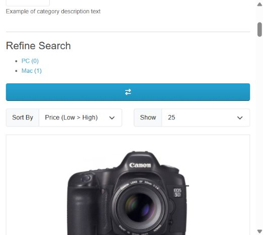

Orden por precio ascendente; la lista completa se conserva en el registro TXT.

---

## Evidencia CP-CAT-02_desc_detalle

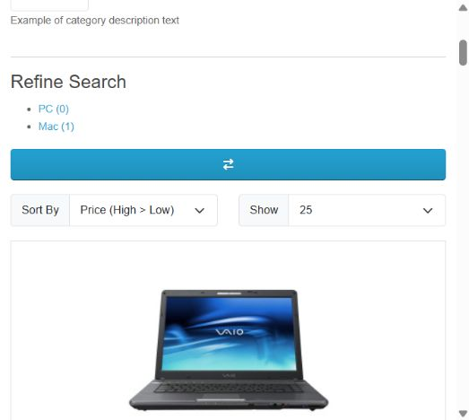

Orden por precio descendente; mismos 12 productos. Captura adicional al registro inicial.

---

## Evidencia CP-PRO-01_resultado

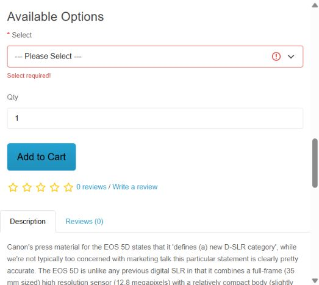

Omisión Select en Canon; validación requerida. Respaldo TXT para contador y mensaje.

---

## Evidencia CP-PRO-02_bloqueo_detalle

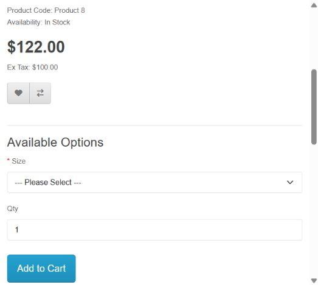

Product 8 no ofrece valor Size; bloquea configuración válida. Captura adicional del campo.

---

## Evidencia CP-CAR-01_qty1

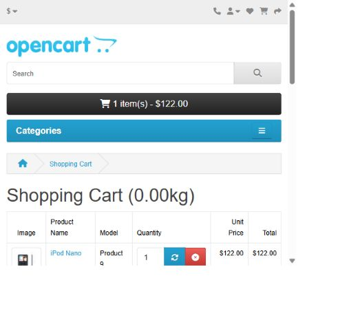

Una unidad de Nano: referencia de precio y línea.

---

## Evidencia CP-CAR-01_qty2

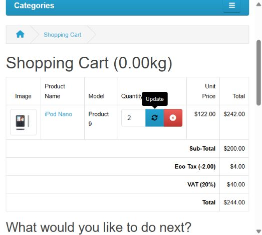

Dos unidades: línea 242 frente a total 244; complementada por H-OC04.

---

## Evidencia CP-CAR-02_stock147

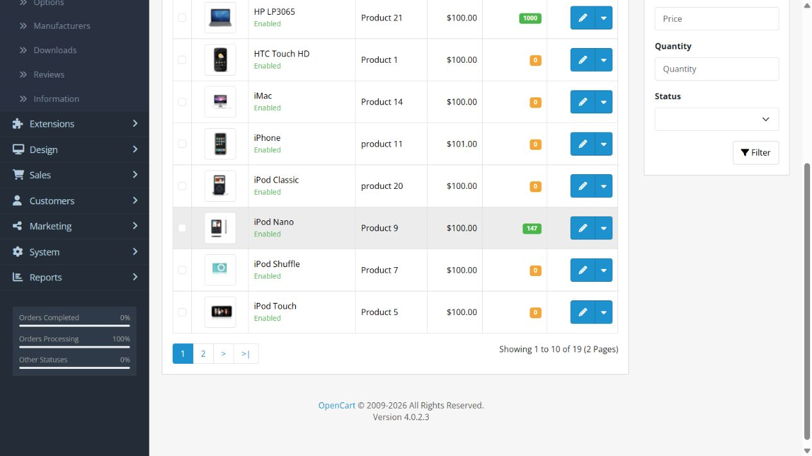

Lectura administrativa del stock 147 antes de frontera.

---

## Evidencia CP-CAR-02_stock-bloquea-checkout

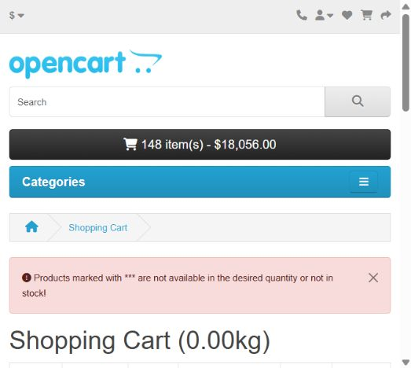

148 unidades: checkout retorna al carrito con advertencia.

---

## Evidencia CP-CUP-01_cupones-no-vigentes

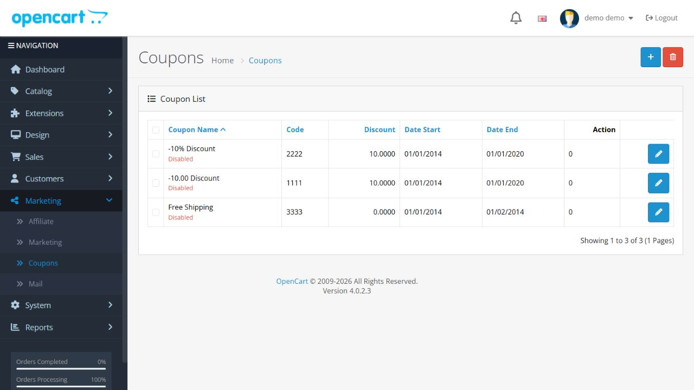

Cupones deshabilitados y vencidos; TXT preserva los 3 registros.

---

## Evidencia CP-CUP-02_error-visible

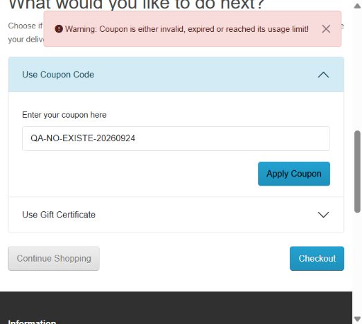

Código inexistente rechazado; ningún descuento nuevo.

---

## Evidencia CP-CUP-02_vencido-error

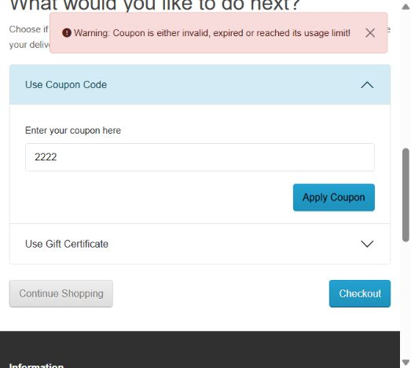

2222 rechazado; no es representante válido.

---

## Evidencia CP-CHK-01_sin-pago

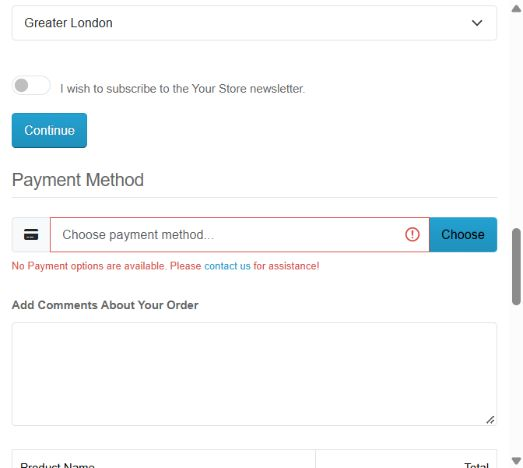

No Payment options are available; Confirm Order deshabilitado.

---

## H-OC04. Importe de carrito - 24/09

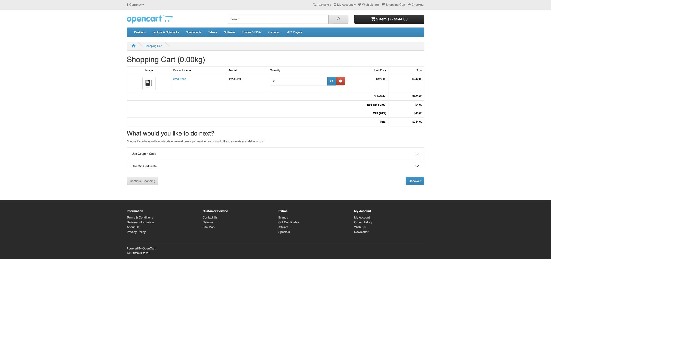

Evidencia adicional de DEF-01. La línea debe compararse con un importe que utilice el mismo tratamiento fiscal.

---

## H-OC01 y H-OC02. Configuración de pago - 24/09

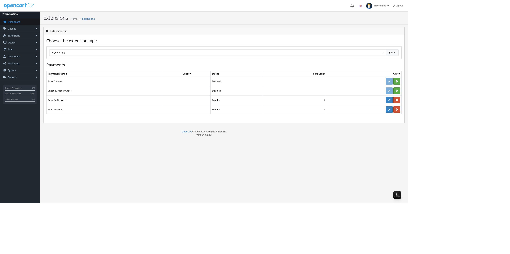

24/09: métodos listados; no acredita por sí solo aplicabilidad a todos los carritos.

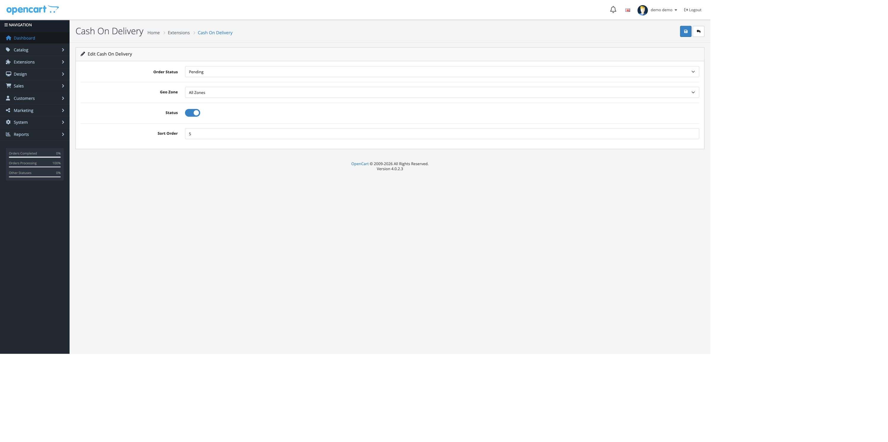

24/09: COD con All Zones; hipótesis de causa pendiente.

---

## H-ADM. Restricción administrativa

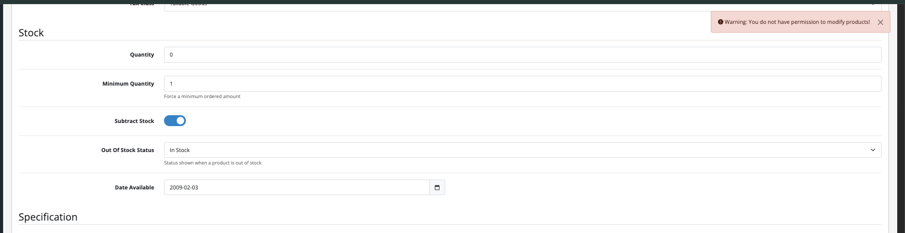

24/09: Warning: You do not have permission to modify products! La captura muestra Quantity 0 y estado In Stock en formulario. No demuestra guardado exitoso, stock persistido 1000 ni estado Out Of Stock. Identidad del producto no visible en este recorte.
